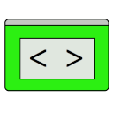
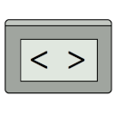

# JSADD - JavaScript Anti-Debugging Detection Tool

## About
JSADD is a browser extension which detects common techniques implemented by websites that aim to impede, alter or detect debugging attempts using the integrated Developer Tools.

## Supported anti-debugging techniques
JSADD supports the detection of the following anti-debugging techniques:
- ShortCut (Impediment) [[1]](#1)
- TrigBreak (Impediment) [[1]](#1)
- ConClear (Impediment) [[1]](#1)
- ModBuilt (Alteration) [[1]](#1)
- WidthDiff (Detection) [[1]](#1)
- LogGet (Detection) [[1]](#1)
- Firebug Lite (Detection) (Chrome) [[2]](#2)

## Currently supported browsers
- Chromium-based browsers (e.g. Google Chrome)

## References
<a id="1">[1]</a>
Marius Musch and Martin Johns (2021).
“U Can’t Debug This: Detecting JavaScript Anti-Debugging Techniques in the Wild”.
In: 30th USENIX Security Symposium (USENIX Security 21). USENIX Association pp. 2935–2950.  
<a id="2">[2]</a>
Sindre Sorhus.
GitHub repository [devtools-detect](https://github.com/sindresorhus/devtools-detect).

## License
[GPLv3](LICENSE.txt)